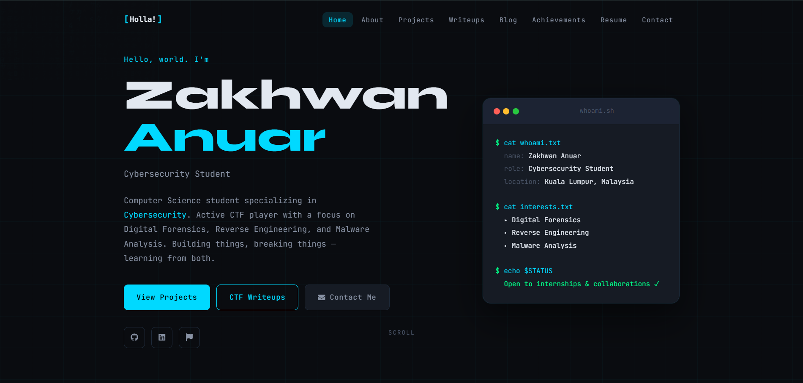

# Zakhwan Anuar — Personal Website

My personal portfolio and blog, live at **[zakhwananuar.my](https://zakhwananuar.my)** 🌐

> Cybersecurity student · CTF player · builder of things I can break and learn from.

If you found this repository, come say hi on the site — it's where I keep my projects, CTF writeups, and the occasional blog post.

[](https://zakhwananuar.my)

## 🔗 Visit the site

### ➡️ **[zakhwananuar.my](https://zakhwananuar.my)**

## What's inside

| Page | What you'll find |
|---|---|
| **Home** | Quick intro and featured work |
| **About** | Who I am and what I'm into |
| **Projects** | Things I've built, broken, and learned from |
| **Writeups** | CTF and security challenge walkthroughs |
| **Blog** | Notes and thoughts, mostly on security |
| **Achievements** | Competitions, talks, and milestones |
| **Resume** | The formal version |
| **Contact** | How to reach me |

## Built with

- Plain **HTML, CSS, and JavaScript** — no framework, no build step
- Content driven by simple data files in [`data/`](data/) (projects, blog posts, writeups)
- Hosted on **GitHub Pages** with a custom domain

## Running it locally

It's a static site, so any web server works:

```bash
# clone
git clone https://github.com/ZakhwanAnuar/zakhwananuar.github.io.git
cd zakhwananuar.github.io

# serve (pick one)
python -m http.server 8000
# then open http://localhost:8000
```

## Connect

- 🌐 Website — [zakhwananuar.my](https://zakhwananuar.my)
- 💻 GitHub — [@zakhwananuar](https://github.com/zakhwananuar)
- 💼 LinkedIn — [zakhwan-anuar](https://linkedin.com/in/zakhwan-anuar-88800a217)
